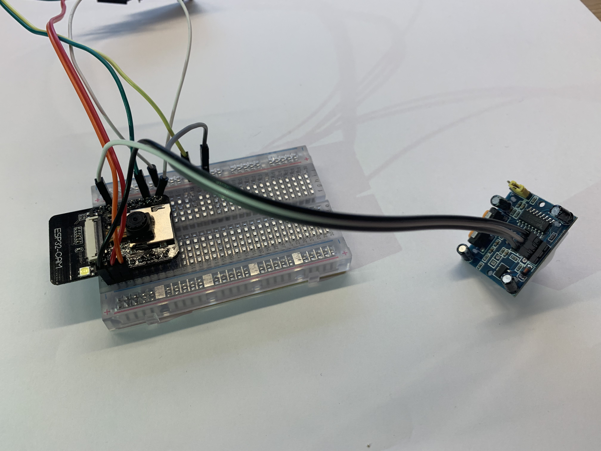

# Build-your-own-security-cam

Workshop details on how to build your own security camera with a ESP32-CAM

This is the Windows version, for macOS go [here](https://github.com/bokse001/Build-your-own-security-cam/blob/master/macOS/readme.md).

## Connect hardware on breadboard


- USBTOTTL pin 5V to ESP pin 5V
- USBTOTTL pin GND to ESP pin GND
- USBTOTTL pin TXD to ESP pin U0R
- USBTOTTL pin RXD to ESP pin U0T


To connect your USBTOTTL to your laptop, you will need a driver for this component. It can be downloaded from: https://www.ftdichip.com/Drivers/VCP.htm

The driver can be installed from the 'Device Manager' in Windows. 


## Prepare your laptop for ESP32 development (for the ones that don't have done it yet. )


See also the website for further explanation on the ESP32 development:  [ESP-IDF](https://docs.espressif.com/projects/esp-idf/en/stable/get-started/)

Preparation of development environment consists of three steps:

1. Setup of **Toolchain**
2. Getting of **ESP-IDF** from GitHub

### Setting up Toolchain on Windows.

*Note; for other operating systems please refer to this page: https://docs.espressif.com/projects/esp-idf/en/stable/get-started/ to setup you toolchain.

1. For windows download this zip file:

<https://dl.espressif.com/dl/esp32_win32_msys2_environment_and_toolchain-20180110.zip>

2. Unzip the file somewhere on your laptop where you have the space for it

3. Now open the MSYS command shell from the just created folder **msys32** called **mingw32.exe**.

4. We need a directory to store our project in called esp, so run the command 

   ```
   mkdir -p ~/esp
   ```

    in the MSYS shell you just started.

5. To continue in that folder move to the esp folder by typing 

   ```
   cd ~/esp
   ```

   

6. Now you have setup toolchain and are ready for the next steps to setup your development environment

### Setting up the ESP IoT Development framework (ESP-IDF)

To setup the ESP-IDF development framework to start developing you own projects there are just 3 steps needed

1. Clone the ESP-IDF framework repository with the following command. (in the ~/esp directory)

   git clone --recursive https://github.com/espressif/esp-who.git

2. To make sure that toolchain can find the ESP-IDF we need to set the path

   ```
   export IDF_PATH="/home/[your-username]/esp/esp-who/esp-idf"
   ```

3. We need Python to be able to build and write the firmware to the ESP. Install it by typing:

   ```
   pacman -S mingw-w64-i686-python2-cryptography
   ```

   Just press enter on the question 

   ```
   :: Proceed with installation? [Y/n]
   ```

   ```
   C:/msys32/mingw32/bin/python.exe -m pip install --user -r C:/msys32/home/a147763/esp/esp-who/esp-idf/requirements.txt
   ```


Make sure your drive (here C:/) matches the drive where you installed the environment

Now you are ready to test your ESP development environment setup 

## Test your laptop and ESP-IDF setup

If you have been following our previous workshop you already now what is coming: blink!

But on the ESP32-CAM it is not just any led blinking; its a flash that you can use later to brighten up the surroundings for the camera.

If you have pre-installed the software and closed it afterwards we have to set up the IDF_PATH again:

```
export IDF_PATH="/home/[your-username]/esp/esp-who/esp-idf"
```

1. First lets copy the example blink project to our esp project directory:

   ```
   cd ~/esp
   ```

2. We have to make some changes in the code, so open your code editor and go to the `ledc_example_main.c` in the `~/esp/ledc/main` folder.

   In this file we have to set the right GPIO pin for the LED, change:

   ```
   #define LEDC_HS_TIMER          LEDC_TIMER_0
   #define LEDC_HS_MODE           LEDC_HIGH_SPEED_MODE
   #define LEDC_HS_CH0_GPIO       (18)            					 change to (4)
   #define LEDC_HS_CH0_CHANNEL    LEDC_CHANNEL_0
   #define LEDC_HS_CH1_GPIO       (19)            					 change to (4)
   #define LEDC_HS_CH1_CHANNEL    LEDC_CHANNEL_1
   
   #define LEDC_LS_TIMER          LEDC_TIMER_1
   #define LEDC_LS_MODE           LEDC_LOW_SPEED_MODE
   #define LEDC_LS_CH2_GPIO       (4)
   #define LEDC_LS_CH2_CHANNEL    LEDC_CHANNEL_2
   #define LEDC_LS_CH3_GPIO       (5)            					 change to (4)
   #define LEDC_LS_CH3_CHANNEL    LEDC_CHANNEL_3 `
   ```

   Now the right LED is selected, we also change the 'TEST_DUTY' to avoid a too bright LED 

   ```
   #define LEDC_TEST_CH_NUM       (4)
   #define LEDC_TEST_DUTY         (4000)							change to (20)
   #define LEDC_TEST_FADE_TIME    (3000)
   ```

   Save the file, and go back to the MSYS command line, we are going to push it to the ESP-32

3. now go into the LED fade directory by typing:

   ```
   cd ledc
   ```

   

4. Now its the time to connect the ESP32-CAM to you laptop with the USBTOTTL adapter. Check which port it is connected by entering the following command in a DOS commandbox (cmd.exe)

   ```
   chgport
   ```

   

5. Remember the COM port, we need this in the next step

6. To upload our program to the ESP32-CAM, we have to set it in 'Download' mode, it can be done by connecting a jumper cable to port IO0 and GND, then we have to press the reset button on the ESP32-CAM, unfortunately it is on the bottom.
7. Now we are ready to compile our blink program and flash it to the ESP32-CAM by:

```
make -j4 flash monitor ESPPORT=COM10
```

4 is the number of logical processors you laptop has. Most of us have 4..

COM10 is an example of the COM port to flash to, please change to reflect your COM port.

Be patient again, this will take considerable time. First it will compile, then build and finally program the ESP. With the "monitor" addition it will directly monitor for incoming messages via the serial from the ESP after it restarts.

You should then see the onboard led flash in a fading pattern. 


## Test to see if the ESP can detect movement

First, we connect a movement sensor, called a PIR sensor to our ESP board. If you remove the cap from the sensor you see the labels of the pins.

Connect:

GND on the PIR to a GND port on your ESP

OUT on the PIR to IO2 on your ESP

VCC to the 5V port on your ESP,

As you can see, the 5V port is already in use. So you have to place the 5V cable from the USB to TTL converter and the 5V from the PIR to the + line on your breadboard, and place a male to male cable between this line and the 5V port on the ESP.




Now copy over the pir example in esp

1. First lets copy the example blink project to our esp project directory:

   ```
   cd ~/esp
   cp -r $IDF_PATH/examples/get-started/blink .
   ```

2. now go into that directory by typing:

   ```
   cd blink
   ```

3. We are now going to edit the code to add the PIR part in the blink code, open in your text editor the  `blink.c`  in the `~/esp/blink/main` folder.

4. First of all, we are going to define the GPIO port of the PIR sensor (IO2 = GPIO port 2), add this code to the example

   ```
   #define PIR_GPIO CONFIG_PIR_GPIO
   ```

5. Replace the blink_task by:

   ```
   void blink_task(void *pvParameter)
   {
   
       gpio_pad_select_gpio(PIR_GPIO); //initialize GPIO port for PIR
       gpio_pad_select_gpio(BLINK_GPIO); //and also for the led
      
       gpio_set_direction(PIR_GPIO, GPIO_MODE_INPUT); //set PIR as input sensor
       gpio_set_direction(BLINK_GPIO, GPIO_MODE_OUTPUT); //set LED as output 
       while(1) {
                       
           /* Blink off (output low) */
           gpio_set_level(BLINK_GPIO, 0);
         
           if(gpio_get_level(PIR_GPIO) == 1) //Read from the PIR sensor
           {
               gpio_set_level(BLINK_GPIO, 1); //LED ON
           }
           else
           {
               gpio_set_level(BLINK_GPIO, 0); //LED OFF
           }
           vTaskDelay(500 / portTICK_PERIOD_MS); //Wait 0,5 seconds before trying again
       }
   }
   ```

   Save this file. 

   We also need to change the configuration menu, so open in your code editor the `Kconfig.projbuild` file (in the same folder as blink.c) and add 

   ```
   config PIR_GPIO
       int "PIR GPIO number"
   	range 0 34
   	default 2
   	help
   		GPIO number (IOxx) to see value of PIR sensor.
   ```

   Save this file, and go back to the command line.

6. In the blink directory type the command: (be patient this might take some time)

```
make j4 menuconfig
```

5. This will open up configuration menu, from this menu select the Example configuration option


5. Then select the Blink GPIO number and set it to the 4 , also set the PIR GPIO number to 2.

5. Save the selections and in the top menu select exit. Be patient after that; it will start preparing the build with those parameters.
6. Now we are ready to compile our blink program and flash it to the ESP32-CAM by:

```
make -j4 flash monitor ESPPORT=COM10
```

-j4 is the number of logical processors you laptop has. Most of us have 4..

COM10 is an example of the COM port to flash to, please change to reflect your comport.

#### **WARNING! The LED is now much brighter, DO NOT look direct towards the light!** ####

When the code is uploaded to your board, you will see a flash when there is a movement detected. At this time this is not so accurate, but we can change the sensitifity settings on the PIR sensor.

There are two potentiometers and one bridge on the sensor to adjust this. 

The first meter is for the delay time after triggering, the second one for the sensitivity. Turning clockwise will result in a better sensitivity. 

The bridge is made for 'retriggering', which means that the PIR keeps reading or stops at the moment that it recognize some movement. Set this bridge to H.

## Test to see if the ESP can hold a webserver

1. First copy over the http_server simple example in esp


```
cd ~/esp
cp -r $IDF_PATH/examples/protocols/http_server/simple .
```

2. now go into that directory by typing:

```
cd simple
```

3. In the blink directory type the command: (be patient this might take some time)

```
make j4 menuconfig
```

4. This will open up configuration menu, from this menu select the Example configuration option

5. Change the settings for SSID and password to refect your wifi settings 

6. Save the selections and in the top menu select exit. Be patient after that; it will start preparing the build with those parameters.

7. Now we are ready to compile our blink program and flash it to the ESP32-CAM by:

```
make -j4 flash monitor ESPPORT=COM10
```

-j4 is the number of logical processors you laptop has. Most of us have 4..

COM10 is an example of the COM port to flash to, please change to reflect your comport.

After flashing you will see the following in the monitor:


8. Note down the IP address in the monitor and point your browser to <ip adress>/hello

You should see the message "Hello World!" in your browser

## Challenge: combine webserver and movement detection

In this challenge you need to combine the code of the PIR sensor and the simple httpd server so that, when movement is detected, you display this in your webserver.

## Test to see if you can get camera pictures and view them via a browser

1. Start by cloning the following github to your laptop and start the configuration:

```
cd ~/esp
git clone --recursive https://github.com/donny681/ESP32_CAMERA_QR
cd ESP32_CAMERA_QR
make -j4 menuconfig
```


2. Move into the ESP32 Camera Demo Configuration and change the SSID/password. Also select the QR recognize support.

3. Then open the Component config -> ESP32 specific, turn on 'Support for external, SPI-connected RAM

   

4. Now flash it to your ESP32-CAM:

   ```
   make -j4 flash monitor ESPPORT=COM10
   ```


## Challenge: use a QR code to get the Wifi connection params and connect the ESP

Lets first get you started with a QR code reader

For this the following must be changed in the main/main_app.c:

```
#define CAMERA_PIXEL_FORMAT CAMERA_PF_GRAYSCALE
#define CAMERA_FRAME_SIZE CAMERA_FS_QVGA
```

AND set the QR recognition support on. But this we have done in the previous test.

Make also sure to set  the IDF_PATH correctly to the standard esp-idf and not to the one of the esp-who. Then compile this as before.  

When you align the QR code correctly it will display the following in the monitor:


Now create a QR code with the wifi parameters and alter the main_app.c in such a way that it reads these parameters from the QR code and connects to it.

## Now for a bit of AI: face detection and recognition on an ESP32...

Now lets stretch the capabilities of the ESP32-CAM to its max.... Lets use it to detect faces AND recognize them.

1. First of all change to the example directory

```
cd ~/esp/esp-who/examples/single_chip/camera_web_server/
```

2. Prepare the example by editing the wifi parameters in Camera Webserver wifi settings

```
make -j4 defconfig
make -j4 menuconfig
```

3. Set the correct camera config to ESP32-CAM under camera pins

   

4. Now compile and flash it

   ```
   make -j4 flash monitor ESPPORT=COM10
   ```

5. Once flashed and the ESP32 restarts you will see the url to connect to, enter that in your browser and see the magic.

If you correctly align your face it will enable you to detect, enroll your face and recognize it.


