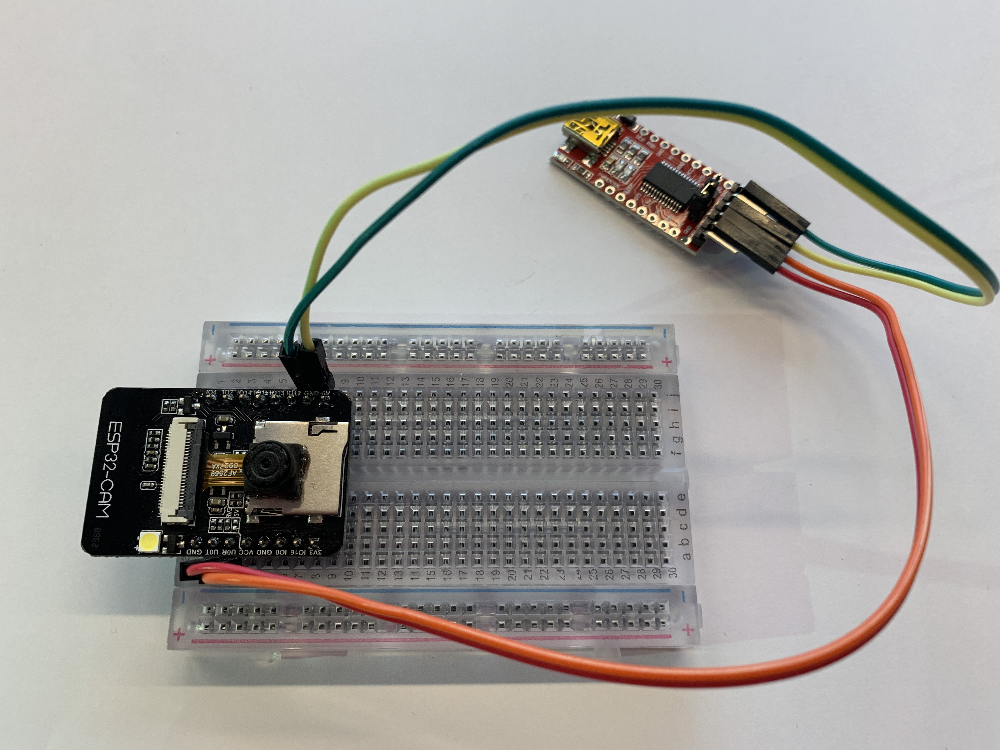

# Build-your-own-security-cam

Workshop details on how to build your own security camera with a ESP32-CAM

You already have installed:

1.  **Toolchain**

2.  **ESP-IDF**

3.  **Text editor** (Visual Studio Code, Ecplise, Atom, Text Wrangler, NotePad++)

If not ask for the USB stick to get the needed files.
If you are following this workshop from home follow the steps until board setup from this url:

`
https://www.Bit.ly/iot-camera
`

## Connect hardware on breadboard

Connect USBTOTTL pin VCC  to ESP pin 5V

Connect USBTOTTL pin GND to ESP pin GND

Connect USBTOTTL pin RX to ESP pin V0T

Connect USBTOTTL pin TX to ESP pin V0R



## Prepare your laptop for ESP32 development

Run the following commands in terminal to check if IDF_PATH & PATH is set:

```
printenv IDF_PATH
```

```
printenv PATH
```


## Test your laptop and ESP-IDF setup

If you followed our previous workshops you already know what is coming: blink!

But on the ESP32-CAM it is not just any led blinking; its a flash that 
you can use later to brighten up the surroundings for the camera.

1. First let’s go to the created esp directory by typing the following command:
```
cd ~/esp
```
2. Let's copy the example blink project to our esp project folder by typing the following command:
```
cp -r $IDF_PATH/examples/peripherals/ledc .
```
3. Now check if the directory is created by typing the command:
```
ls
```

When you have verified that the ledc folder is made go to step 4, if not go back to step 1

4. Open from the new ledc directory the file ledc_example_main.c, in your favorite text editor by typing the following command:
```
cd ~/esp/ledc/main
open ledc_example_main.c
```
**or**
open the file ledc_example_main.c manually from your esp folder in your text editor

The inner Led is connected to GPIO Pin 4. By changing the code from xx to 4, we run this example from the inner led and led it fade in and out

5. For this we have to change:
```
LEDC_HS_CH0_GPIO,
LEDC_HS_CH1_GPIO,
LEDC_LS_CH2_GPIO & LEDC_LS_CH3_GPIO to: 
**(4)**
```
Now the right LED is selected, we also change the 'TEST_DUTY' to avoid a too bright LED 
```
LEDC_TEST_DUTY to: 
**(20)**
```
Result would look like this:
``` #define LEDC_HS_TIMER LEDC_TIMER_0

#define LEDC_HS_MODE LEDC_HIGH_SPEED_MODE

#define LEDC_HS_CH0_GPIO (4)

#define LEDC_HS_CH0_CHANNEL LEDC_CHANNEL_0

#define LEDC_HS_CH1_GPIO (4)

#define LEDC_HS_CH1_CHANNEL LEDC_CHANNEL_1

#define LEDC_LS_TIMER LEDC_TIMER_1

#define LEDC_LS_MODE LEDC_LOW_SPEED_MODE

#define LEDC_LS_CH2_GPIO (4)

#define LEDC_LS_CH2_CHANNEL LEDC_CHANNEL_2

#define LEDC_LS_CH3_GPIO (4)

#define LEDC_LS_CH3_CHANNEL LEDC_CHANNEL_3

#define LEDC_TEST_CH_NUM (4)

#define LEDC_TEST_DUTY (20)

#define LEDC_TEST_FADE_TIME (3000)
......
```
6. Exit & Save ledc_example_main.c
```
CMD+S CMD+Q
```
7. Connect the ESP32 board to your laptop using the USBTOTTL cable
  To check the device name for the serial port of your ESP32 board, run this command:
```
ls /dev/cu.*
```
**Remember the usbserial port, we need this in the next step**

8. Go back to ledc folder
```
cd ~/esp/ledc
```
make the menu configaration to change the usb serial port
``` make menconfig```

9. This will open up configuration menu, from this menu select the Serial Flasher config option

10. Then change the default serial port to your remembered USB serial port:

  

11. Save the selections and in the top menu select exit. Be patient after that; it will start preparing the build with those parameters.

12. Now we are ready to compile our blink program and flash it to the ESP32-CAM by:

   Disconnect  the ESP32 by removing the USBTOTTL from your laptop

13. To upload our program to the ESP32-CAM, we have to set it in 'Download' 
   mode, it can be done by connecting a jumper cable to`GND port` and `1O0 port`

   

14. Connect the ESP32 board to your laptop using the USBTOTTL cable

16. Now we can flash the board by:
```
make -j4 flash monitor ESPPORT=/dev/cu.usbserial-123456
```
4 is the number of logical processors you laptop has. Most of us have 4.

**[/dev/cu.usbserial-123456]** is an example of the usbserial port to flash to, please change to reflect your usbserial port.

Be patient again, this will take considerable time. First it will compile, then build and finally program the ESP. With the "monitor" addition it will directly monitor for incoming messages via the serial from the ESP after it restarts.

17. Remove the jumper cable and restart the device by pressing the reboot button on the bottom of the device. 

You should then see the onboard led flash in a pattern.

## Test to see if the ESP can detect movement
First, we connect a movement sensor, called a PIR sensor to our ESP  board. If you remove the cap from the sensor you see the labels of the  pins.

Connect:

GND on the PIR to a GND port on your ESP
OUT on the PIR to IO2 port on your ESP
VCC to the 5V port on your ESP,

As you can see, the 5V port is already in use. So you have to place  the 5V cable from the USB to TTL converter and the 5V from the PIR to  the + line on your breadboard, and place a male to male cable between  this line and the 5V port on the ESP.


Now copy over the pir example in esp

1. First lets copy the example blink project to our esp project directory:

```
cd ~/esp
cp -r $IDF_PATH/examples/get-started/blink .
```

2. now go into that directory by typing:

```
cd blink
```

3. We are now going to edit the code to add the PIR part in the blink code, open in your text editor the  `blink.c`  in the `~/esp/blink/main` folder.
4. First of all, we are going to define the GPIO port of the PIR sensor (IO2 = GPIO port 2), add this code to the example

```
#define PIR_GPIO CONFIG_PIR_GPIO
```

5. Replace the blink_task by:

```
void blink_task(void *pvParameter)    {

   gpio_pad_select_gpio(PIR_GPIO); //initialize GPIO port for PIR
   gpio_pad_select_gpio(BLINK_GPIO); //and also for the led

   gpio_set_direction(PIR_GPIO, GPIO_MODE_INPUT); //set PIR as input sensor
   gpio_set_direction(BLINK_GPIO, GPIO_MODE_OUTPUT); //set LED as output 
   while(1) {

       /* Blink off (output low) */
       gpio_set_level(BLINK_GPIO, 0);

       if(gpio_get_level(PIR_GPIO) == 1) //Read from the PIR sensor
       {
           gpio_set_level(BLINK_GPIO, 1); //LED ON
       }
       else
       {
           gpio_set_level(BLINK_GPIO, 0); //LED OFF
       }
       vTaskDelay(500 / portTICK_PERIOD_MS); //Wait 0,5 seconds before trying again
   }

}
```

Save this file. 

We also need to change the configuration menu, so open in your code editor the `Kconfig.projbuild` file (in the same folder as blink.c) and add 

```
config PIR_GPIO
  int "PIR GPIO number"
  range 0 34
  default 2
  help
    GPIO number (IOxx) to see value of PIR sensor.
```

Save this file, and go back to the command line.

6. In the blink directory type the command: (be patient this might take some time)

```
make -j4 menuconfig
```

7. This will open up configuration menu, from this menu select the __Example configuration__ option


8. Then select the Blink GPIO number and set it to the 4 , also set the PIR GPIO number to 2.
9. Save the selections and in the top menu select exit. Be patient after  that; it will start preparing the build with those parameters.
10. Disconnect  the ESP32 by removing the USBTOTTL from your laptop . 
To upload our program to the ESP32-CAM, we have to set it in 'Download' 
   mode, it can be done by connecting a jumper cable to`GND port` and `1O0 port`
11. Now we are ready to compile our blink program and flash it to the ESP32-CAM by:

```
make -j4 flash monitor ESPPORT=/dev/cu.usbserial-123456
```

-j4 is the number of logical processors you laptop has. Most of us have 4..

#### **WARNING! The LED is now much brighter, DO NOT look direct towards the light!**

When the code is uploaded to your board, you will see a flash when  there is a movement detected. At this time this is not so accurate, but  we can change the sensitifity settings on the PIR sensor.

There are two potentiometers and one bridge on the sensor to adjust this. 

The first meter is for the delay time after triggering, the second  one for the sensitivity. Turning clockwise will result in a better  sensitivity. 

The bridge is made for 'retriggering', which means that the PIR keeps  reading or stops at the moment that it recognize some movement. Set  this bridge to H.

## Test to see if the ESP can hold a webserver
First copy over the http_server simple example in esp

1. Copy the example http_server project to our esp project directory:
```
cd ~/esp 
cp -r $IDF_PATH/examples/protocols/http_server/simple .
```

2. Now go into that directory by typing:
```
cd simple
```

3. In the simple directory type the command: (be patient this might take some time)
```
make j4 menuconfig
```
This will open up configuration menu.

4. From this menu select the Example configuration option.

5. Change the settings for SSID and password to refect your wifi settings

Save the selections and in the top menu select exit. Be patient after that; it will start preparing the build with those parameters.

6. Now we are ready to compile our blink program and flash it to the ESP32-CAM by:

7. Disconnect  the ESP32 by removing the USBTOTTL from your laptop

8. To upload our program to the ESP32-CAM, we have to set it in 'Download' 
   mode, it can be done by connecting a jumper cable to`GND port` and `1O0 port`

    

 9. Connect the ESP32 board to your laptop using the USBTOTTL cable. 

 10. Now we can flash the board by: 
```
make -j4 flash monitor ESPPORT=/dev/cu.usbserial-123456
```
-j4 is the number of logical processors you laptop has. Most of us have 4.

[/dev/cu.usbserial-123456] is an example of the usbserial port to flash to, please change to reflect your usbserial port.

7. Remove the jumper cable and restart the device by pressing the reboot button on the bottom of the device. 

After flashing you will see the following in the monitor:


8. Note down the IP address in the monitor and point your browser to `<ipadress>/hello`

You should see the message "Hello World!" in your browser


## Challenge: combine webserver and movement detection

In this challenge you need to combine the code of the PIR sensor and the simple httpd server so that, when movement is detected, you display this in your webserver.

**Test to see if you can get camera pictures and view them via a browser**

## Test to see if you can get camera pictures and view them via a browser

**Ask for the usb stick with files for the next challenge**

1. Start by adding the files to your esp folder and start the configuration:

```
cd ~/esp
```

```
cd ESP32_CAMERA_QR
```

```
make -j4 menuconfig
```

if your working from home:

2. Start by cloning the following github to your laptop and start the configuration:

```
cd ~/esp
git clone --recursive https://github.com/donny681/ESP32_CAMERA_QR
```
3. Open the Camera QR directory & open the menuconfiguration

```
cd ESP32_CAMERA_QR
make -j4 menuconfig
```

4. Move into the ESP32 Camera Demo Configuration and change the SSID/password.
5. Also select the QR recognize support. Press Y in the configuration settings


6. Go to component config

7. Go to Esp-32 specific

8. Add Y in Support for external, SPI connected RAM field

   

9. Disconnect the ESP32 by removing the USBTOTTL from your laptop

10. To upload our program to the ESP32-CAM, we have to set it in 'Download' 
   mode, it can be done by connecting a jumper cable to`GND port` and `1O0 port`

    

11. Connect the ESP32 board to your laptop using the USBTOTTL cable. 

12. Now we can flash the board by: 
```
make -j4 flash monitor ESPPORT=/dev/cu.usbserial-123456
```

13. Remove the jumper cable and restart the device by pressing the reboot button on the bottom of the device. 

After flashing you will see the following in the monitor:


14. Note down the IP address in the monitor and point your browser to `<ipadress>/pgm`

to make a single picture. 


## Challenge: use a QR code to get the Wifi connection params and connect the ESP

1. For this the following must be changed in the main/main_app.c:

```
#define CAMERA_PIXEL_FORMAT CAMERA_PF_GRAYSCALE
#define CAMERA_FRAME_SIZE CAMERA_FS_QVGA
```
2. Set the QR recognition support on. But this we have done in the previous test.
3. When you align the QR code correctly it will display the following in the monitor:
4. Now create a QR code with the wifi parameters and alter the app_main.c in such a way that it reads these parameters from the QR code and connects to it.

## Now for a bit of AI: face detection and recognition on an ESP32...

Now lets stretch the capabilities of the ESP32-CAM to its max.... Lets use it to detect faces AND recognize them.

1. Go to your esp directory and clone the git

```
git clone --recursive https://github.com/espressif/esp-who.git
```

2. First of all change to the example directory

```
cd ~/esp/esp-who/examples/single_chip/camera_web_server/
```

2. Prepare the example by editing the wifi parameters in Camera Webserver wifi settings

```
make -j4 defconfig
make -j4 menuconfig
```

3. Set the correct camera config to ESP32-CAM under camera pins


4. Now compile and flash it

```
make -j4 flash monitor ESPPORT=/dev/cu.xxxxx
```

5. Once flashed and the ESP32 restarts you will see the url to connect to, enter that in your browser and see the magic.

If you correctly align your face it will enable you to detect, enroll your face and recognize it

